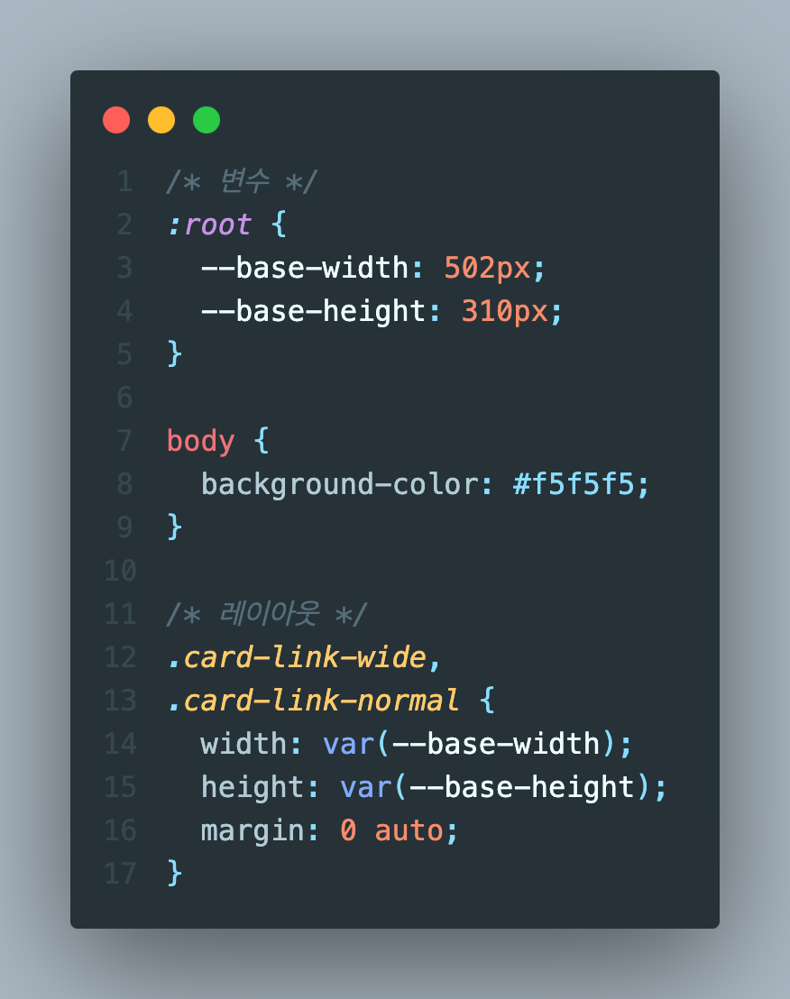
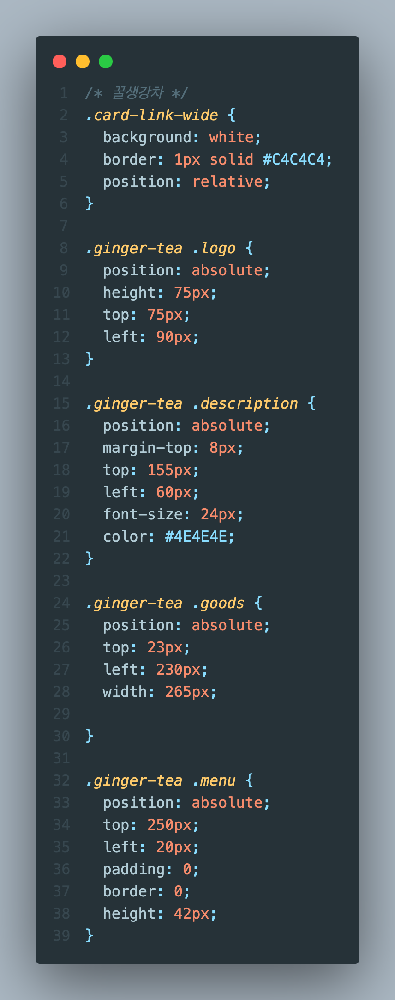
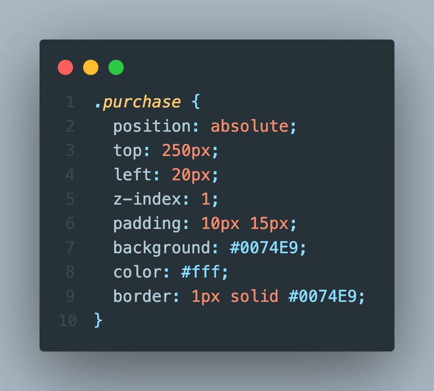

# 2023.11.2 / 과제 1

- [x] 과제 완성 화면

## STEP 1 - HTML

- [x] 외부 스타일시트 연결
- [x] article 태그로 card-link-wide, card-link-normal 구성
- [x] 2개의 normal 사이즈를 같이 움직이기 위해 normal-wrapper로 묶음

- [x] 각각의 카드마다 세부 태그 내용 구성

- [x] 핸드크림은 메뉴 버튼을 구매하기 버튼으로 대체

## STEP 2 - CSS

- [x] 기본 레이아웃 크기와 배경색 지정 후 가운데 정렬

- [x] 각 상품의 가장 상위 요소인 card-link 태그들에 relative를 주고
- [x] 하위 요소에 absolute를 주어
- [x] 속해있는 card-link 기준으로 이미지와 텍스트 배치 하였음

- [x] normal 사이즈 태그들을 flex로 묶어 row 가운데 정렬하고
- [x] wide 사이즈에 맞춰 배치함

- [x] 핸드크림의 구매하기 버튼에 z-index 값을 주어 사진 위로 올라오게 함
