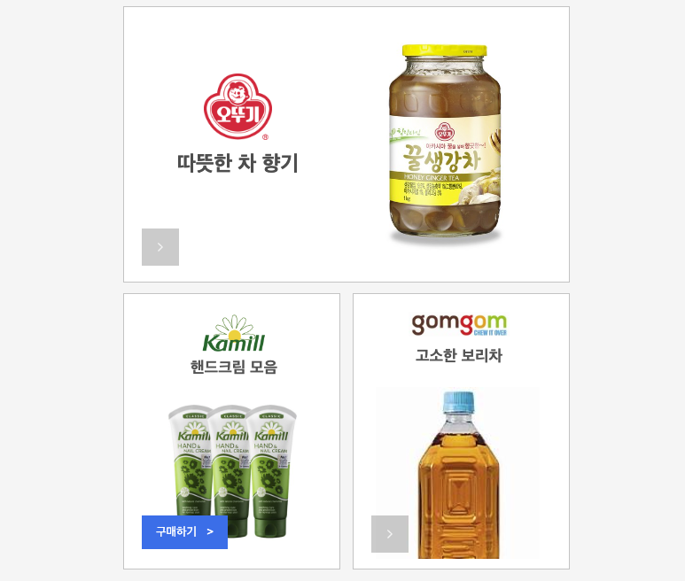
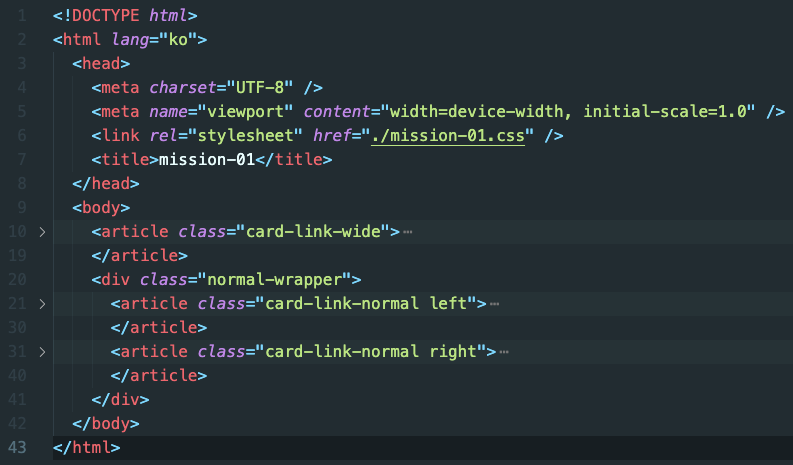
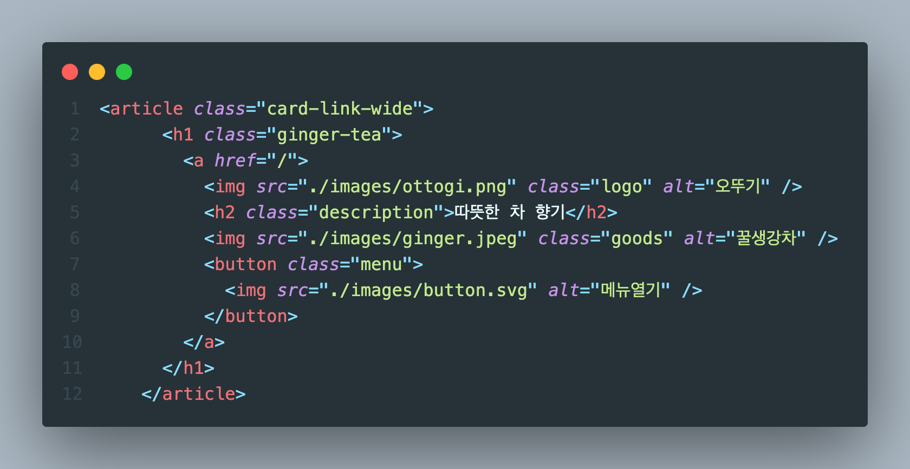
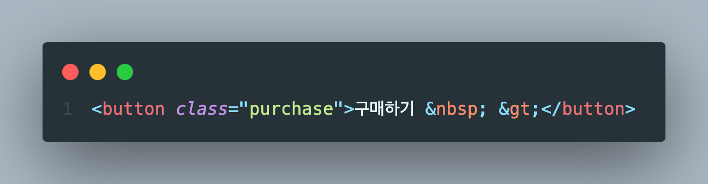

# 2023.11.2 / 과제 1

과제 완성 화면

## STEP 1 - HTML

- [x] 외부 스타일시트 연결
- [x] article 태그로 card-link-wide, card-link-normal 구성
- [x] 2개의 normal 사이즈를 같이 움직이기 위해 normal-wrapper로 묶음

- [x] 각각의 카드마다 세부 태그 내용 구성

- [x] 핸드크림은 메뉴 버튼을 구매하기 버튼으로 대체

## STEP 2 - CSS

- [x] Segment로 CollectionView와 TableView 보여주기
- [x] TableView에서 SwipeAction으로 북마크, 삭제 넣기
- [x] CollectionView에서 꾹눌러 북마크, 삭제
