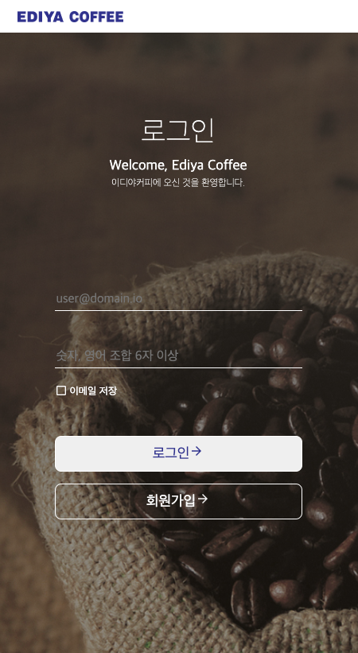
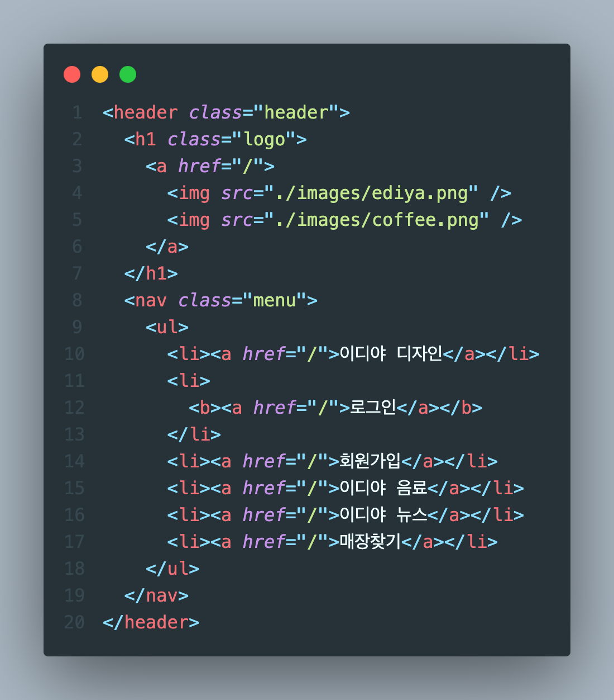

# 2023.11.9 / 과제 2

 

 

- [x] 과제 완성 화면 PC / tablet / mobile

## STEP 1 - header

 

- [x] flex-box로 제어하기 위해 logo, menu 부분을 각각 묶음
- [x] header 전체에 flex, center 값을 주어 row 가운데 정렬함
- [x] logo, menu 클래스에 다시 flex 값을 주어 row 정렬 후 위치 조정

 

## STEP 2 - main

 

- [x] 로그인 페이지 main 영역 background 크기, 이미지 설정
- [x] login-area 하위로 구역을 나눠 3개의 클래스로 구성

 

 

- [x] login-area 전체 너비 지정, 세로 정렬
- [x] login-description 세로 정렬, 크기 지정

 

 

- [x] login-form 하위로 구역을 나눠 3개의 클래스로 구성
- [x] focus, valid, invalid 설정은 모르겠어서 hidden 처리 해두었음...

 

 

- [x] button 내부의 화살표 위치를 오른쪽으로 옮겨서 정렬하고 싶은데 방법을 모르겠음 😩

 

## 11/13 피드백 수정

 

- 에러메시지와 입력서식의 연관성을 알 수 없음

 

- [x] 에러 메시지에 대한 설명 추가

 

- 체크박스를 이미지로 마크업 함

 

- [x] input 태그로 변경 후 type 지정

 

 

- [x] is--invalid 클래스 추가시 메시지 출력

 

- 패스워드 보기/감추기를 이미지로 마크업 함
  - [ ] 해결 실패 ! ☺️
