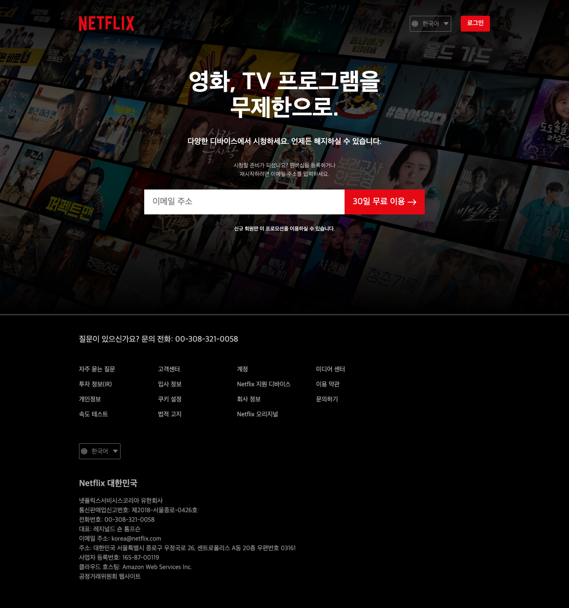
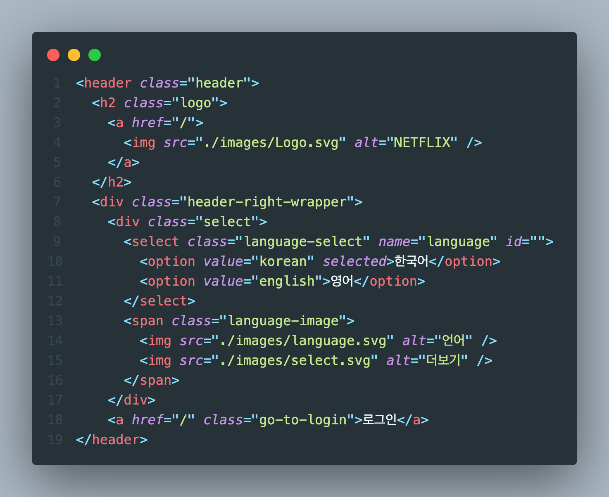
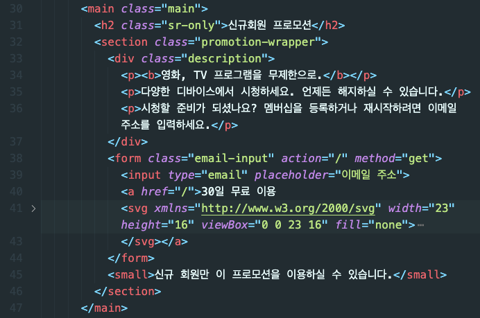
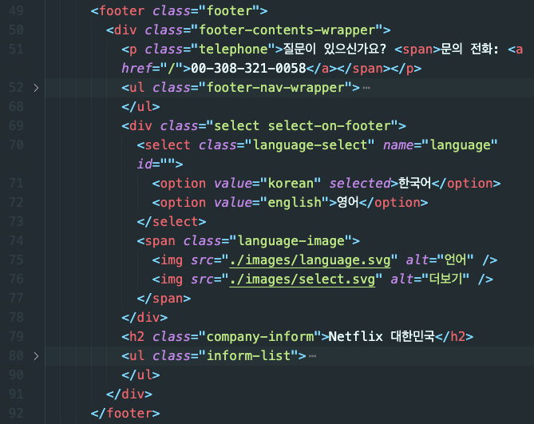
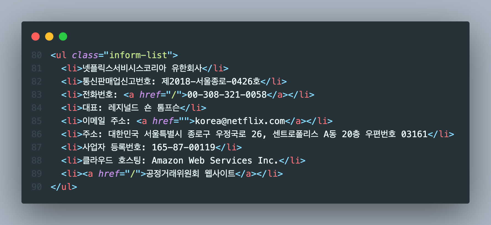

# 2023.11.13 / 과제 3

 

 

- [x] 과제 완성 화면 PC / mobile (375px)

## STEP 1 - header

 

- [x] 언어 선택 박스 전체에 relative, 이미지에 absolute를 주어 이미지 이동
- [x] 로그인 박스는 로그인 페이지로 이동하기 위해 a태그 사용

 

## STEP 2 - main

 

- [x] 프로모션 영역 전체를 묶어서 가운데 정렬, 각 요소 사이 gap 지정
- [x] 이메일 input이 화면 너비에 따라 알아서 줄어들게 하고 싶었으나 안줄어들어서 미디어 쿼리로 하나하나 직접 줄임 😡

 

 

- [x] footer-nav-wrapper 하위의 li 안에 a태그 사용하여 클릭 시 페이지 이동할 수 있게 함
- [x] header의 select 박스 재사용

 

 

- [x] inform-list 에서 하이퍼링크가 필요할 것 같은 요소들에 a태그 사용

 

- [ ] rem em 사용법을 잘 모르겠음. 그래서 단위가 뒤죽박죽 !!
- [ ] 이메일 input 외에도 화면 너비에 따라 요소가 알아서 줄어들었으면 좋겠는데
- [ ] 안줄어들어서 미디어 쿼리로 덕지덕지 줄였음 😂
